# Demo

# Dashboard

  

  iOS
  

    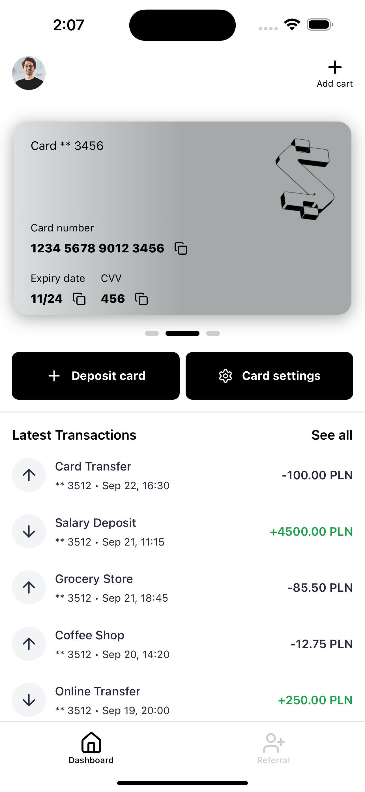
    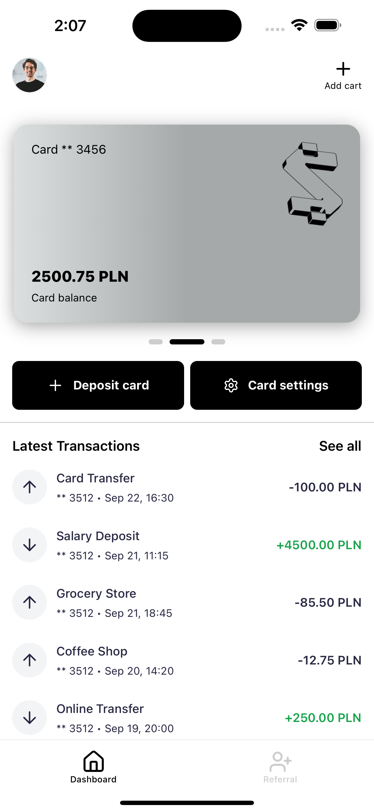
    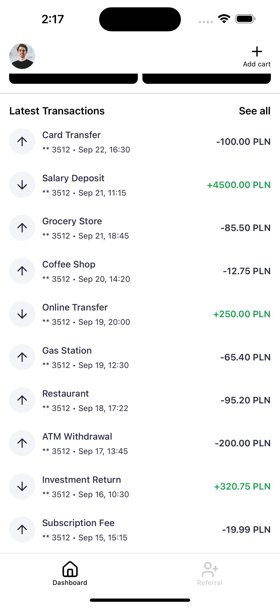
  

  

   

  Android
  

    
    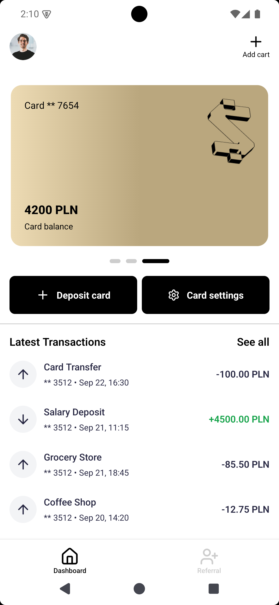
    
  

  

# Deposit

  

  iOS
  

    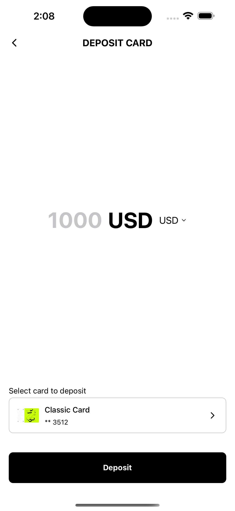
    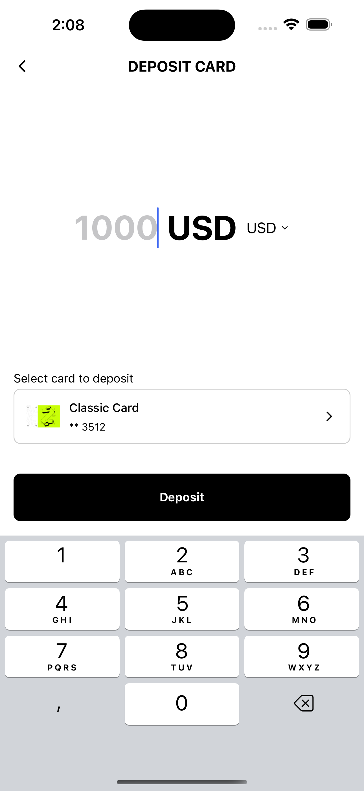
    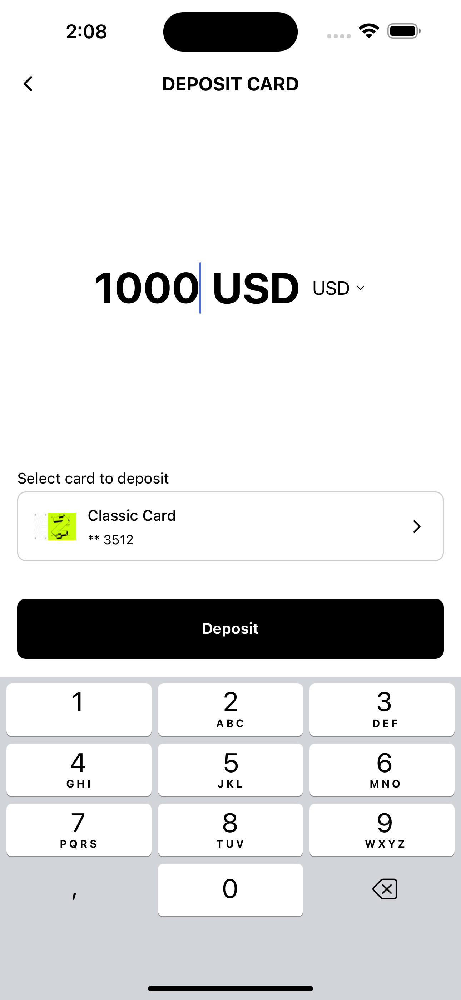
  

  

   

  Android
  

    
    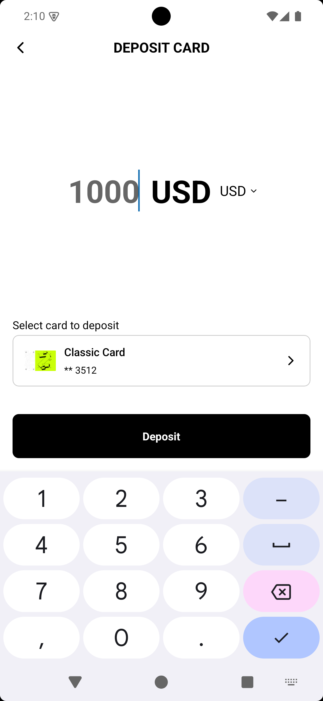
    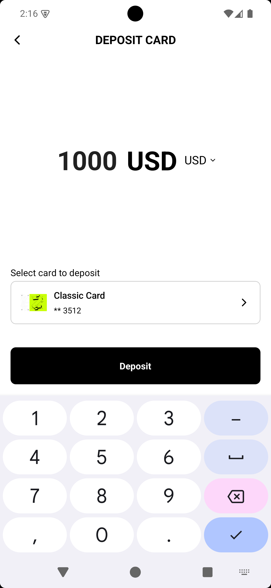
  

  

# Deposit success

  

  iOS
  

    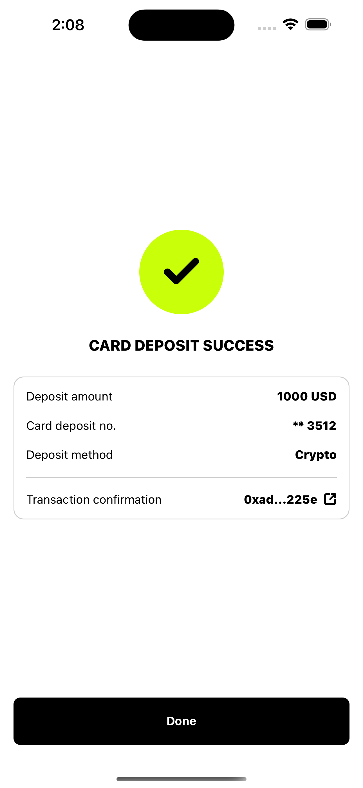
  

  

   

  Android
  

    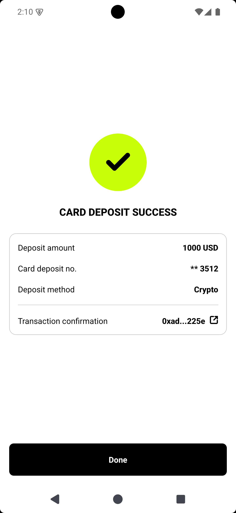
  

  

